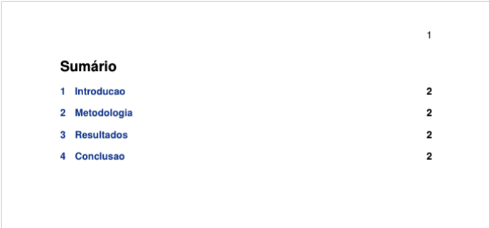
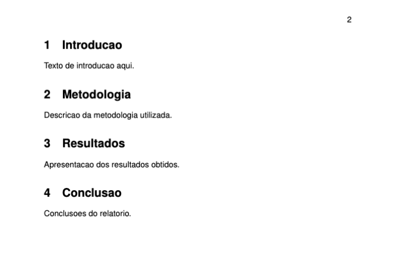

# Kinebot LaTeX Report Template

LaTeX template for Kinebot company reports.

## Preview

The company footer banner appears on every page of the report, as shown below.

### Cover Page


### Table of Contents



### Content



> **Note:** The table of contents and content screenshots are cropped — the footer banner is present at the bottom of every page, as seen in the cover page screenshot.

## Prerequisites

A LaTeX distribution installed:

- **macOS**: [MacTeX](https://www.tug.org/mactex/)
- **Linux**: TeX Live (`sudo apt install texlive-full` or equivalent)
- **Windows**: [MikTeX](https://miktex.org/)

All packages used (`fancyhdr`, `geometry`, `graphicx`, `helvet`, `hyperref`, `xcolor`, `babel`) are included in standard distributions.

## Project Structure

```
template_latex/
├── main.tex              # Main document (duplicate for each report)
├── kinebot.sty           # Style package (do not edit)
├── images/
│   └── footer_banner.png # Company banner (footer)
└── README.md
```

## How to Compile

Recommended method (automatically runs the required number of passes):

```bash
latexmk -pdf main.tex
```

Or manually (run twice to generate the table of contents):

```bash
pdflatex main.tex
pdflatex main.tex
```

To clean auxiliary files:

```bash
latexmk -c
```

## How to Use

1. Duplicate `main.tex` with the desired name (e.g., `report-project-x.tex`)

2. Edit the metadata at the top of the file:

```latex
\reporttitle{Report Title}
\reportsubtitle{Brief description}
\reportauthor{Author Name}
\reportdate{\today}
\reportref{v1.0}
```

3. Write your content in sections:

```latex
\section{Introduction}
Your text here.

\subsection{Subsection}
More details.
```

4. Compile the PDF.

## Available Commands

| Command | Description |
|---|---|
| `\reporttitle{...}` | Report title (cover page) |
| `\reportsubtitle{...}` | Subtitle/description (cover page) |
| `\reportauthor{...}` | Report author(s) |
| `\reportdate{...}` | Date (default: `\today`) |
| `\reportref{...}` | Document version |
| `\makecover` | Generates the cover page |

## Customization

### Margins

Margins are defined in `kinebot.sty`. If the footer banner height changes, adjust the bottom margin and `\footskip` proportionally:

```latex
% In kinebot.sty
\RequirePackage[
  ...
  bottom=3.0cm  % Adjust based on banner height
]{geometry}
\setlength{\footskip}{1.8cm}  % Adjust together with bottom
```

### Including Figures

```latex
\begin{figure}[htbp]
  \centering
  \includegraphics[width=0.8\textwidth]{images/my-figure}
  \caption{Figure description.}
  \label{fig:my-figure}
\end{figure}
```

### Including Tables

```latex
\begin{table}[htbp]
  \centering
  \caption{Table description.}
  \begin{tabular}{lcc}
    \hline
    Column 1 & Column 2 & Column 3 \\
    \hline
    Data 1   & Data 2   & Data 3   \\
    \hline
  \end{tabular}
  \label{tab:my-table}
\end{table}
```
